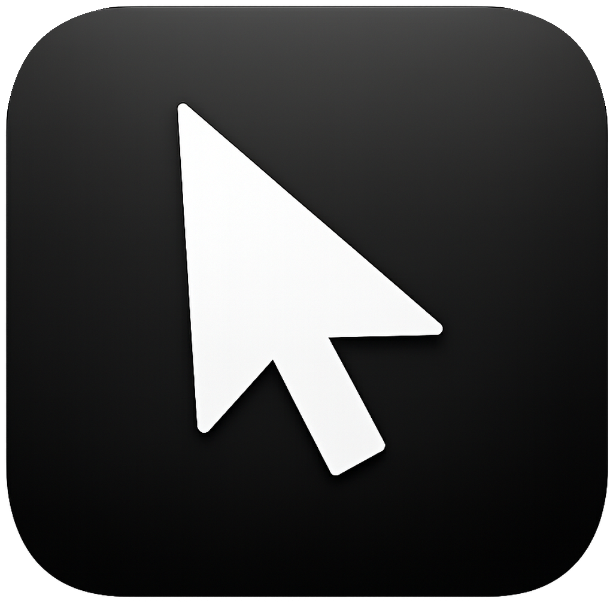
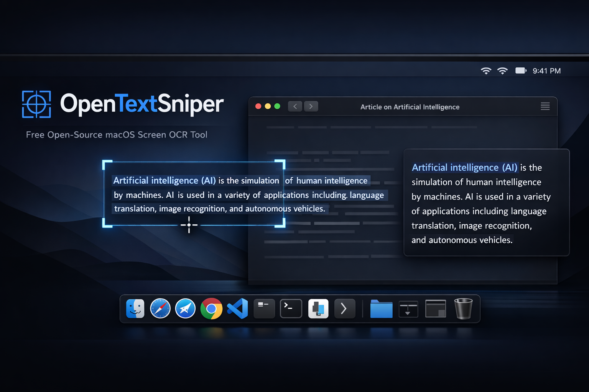

<p align="center">
  
</p>

<h1 align="center">OpenTextGrabber</h1>

<p align="center">Free, open-source screen OCR for macOS. Select any region on your screen and instantly copy the text to your clipboard.</p>

<p align="center">
  
</p>

Inspired by [TextSniper](https://textsniper.app/) — built because I wanted the same thing but free and open-source.

## Features

- **Screen OCR** — Select any region, text is recognized and copied to clipboard
- **Global hotkey** — `Cmd+Shift+2` by default, fully customizable
- **Clipboard history** — Last 50 captures stored, accessible from the menubar
- **Lightweight** — Native Swift, no Electron, no external dependencies
- **30 languages** — Powered by Apple Vision, supports all major scripts out of the box
- **Private** — All OCR runs on-device via Apple Vision framework. Nothing leaves your Mac.

## Requirements

- macOS 14.0+ (Sonoma or later)
- Apple Silicon (arm64)

## Build

```bash
git clone https://github.com/Herfstvalt/OpenTextGrabber.git
cd OpenTextGrabber
chmod +x build.sh
./build.sh
open build/OpenTextGrabber.app
```

No Xcode project needed — compiles directly with `swiftc`.

## Usage

1. Launch the app — it lives in your menubar (magnifying glass icon)
2. Press **Cmd+Shift+2** or click **Capture Text** from the menu
3. Drag to select a region — cursor becomes a crosshair
4. Text is OCR'd and copied to your clipboard
5. **Escape** or **right-click** to cancel

### First Launch

macOS will ask for **Screen Recording** permission. Grant it in:

> System Settings > Privacy & Security > Screen Recording

Then restart the app.

## How It Works

| Component | Technology |
|-----------|-----------|
| OCR | Apple Vision (`VNRecognizeTextRequest`) — accurate mode with language correction |
| Screen capture | ScreenCaptureKit (`SCScreenshotManager`) |
| Global hotkey | Carbon `RegisterEventHotKey` |
| UI | AppKit (menubar app, `LSUIElement`) |

Built entirely with native Apple frameworks — zero external dependencies.

## Supported Languages

Arabic, Chinese (Simplified), Chinese (Traditional), Cantonese (Simplified), Cantonese (Traditional), Czech, Danish, Dutch, English, French, German, Indonesian, Italian, Japanese, Korean, Malay, Norwegian (Bokmål), Norwegian (Nynorsk), Polish, Portuguese (Brazilian), Romanian, Russian, Spanish, Swedish, Thai, Turkish, Ukrainian, Vietnamese

All recognition runs on-device via Apple Vision — no internet connection needed.

## References

> *Every project stands on the shoulders of others.*

This project was inspired by [TextSniper](https://textsniper.app/). Full kudos to the original app — if you want a polished, feature-rich commercial product, go support them.

| Project | What we learned | Where we applied it |
|---------|----------------|---------------------|
| [textsniper.app](https://textsniper.app/) | The core concept — select a screen region, OCR it, copy to clipboard. TextSniper proved this workflow is indispensable and inspired OpenTextGrabber as a free, open-source alternative. | The entire app architecture: hotkey → region selection → Vision OCR → clipboard |

*Generated by [ossref](https://github.com/herfstvalt/ossref)*

## License

MIT
